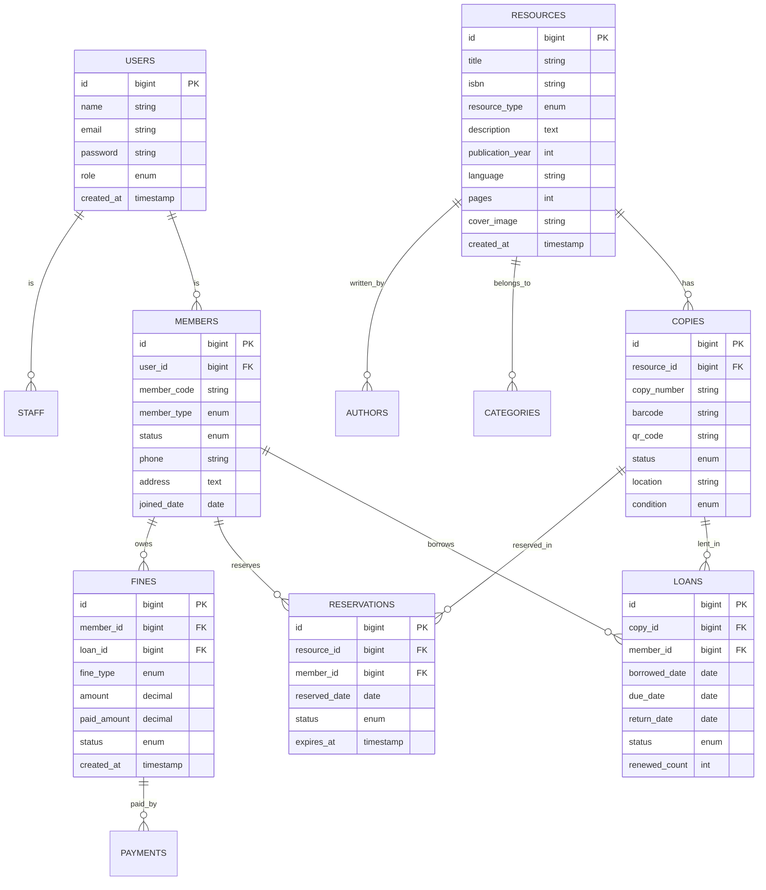

# Architecture & Database Schema

## Overview

The Library Management System is built on a decoupled architecture with a Laravel 12 backend serving both a web-based admin panel (using Dash UI) and a Next.js 14+ frontend for library members.

### Technical Stack

- **Backend**: Laravel 12
- **Admin Panel**: Dash UI (TailwindCSS + Blade)
- **User Frontend**: Next.js 14+ (App Router)
- **Database**: MySQL 8.0+
- **Auth**: Laravel Breeze (Admin) / Laravel Sanctum (User API)

## Database Schema (ER Diagram)

## System Components

1. **Cataloging Service**: Manages books, e-books, and digital resources.
2. **Circulation Engine**: Handles check-outs, check-ins, and automated due date calculations.
3. **Fine Management**: Tracks and processes offline payments for late items.
4. **Notification Engine**: Dispatches emails and SMS for reminders.
5. **Analytics Service**: Aggregates data for library performance reporting.
